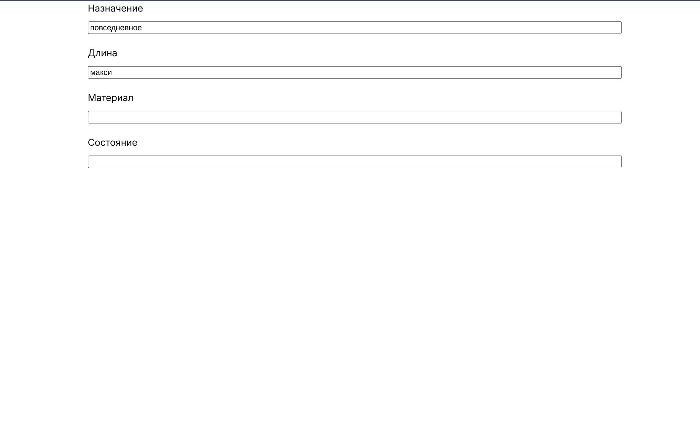

## Тестовое задание: Редактор параметров (React + TS + Git) Selsup



## Задача

Реализовать на React (TypeScript) компонент(ы), которые позволяют редактировать структуру `Model` на основе списка `params: Param[]` и начального `model: Model`. Все параметры должны быть видны сразу и доступны для редактирования. Метод `getModel()` должен возвращать полную структуру `Model` со всеми проставленными значениями параметров.

## Стек

### Frontend

- TypeScript 
- React 

### Сборка и стили

- Vite 
- SASS 

### Тестирование

- Vitest 

## Запуск

1. Установка зависимостей
```shell
npm i
```
2. Запуск dev-сервера
```shell
npm run dev
```

3. Запуск тестов
```shell
npm run test
```

## Решение

- Решение задачи в файле [src/param-editor.tsx](./src/param-editor.tsx)

- Тесты в файле [src/param-editor.test.tsx](./src/param-editor.test.tsx)

### Результаты тестов

```shell
 ✓ src/param-editor.test.tsx (3 tests) 268ms
   ✓ Param editor tests (3)
     ✓ Renders fields based on params 244ms
     ✓ Initializes correctly from model.paramValues 9ms
     ✓ Returns correct model from getModel after changes 14ms

 Test Files  1 passed (1)
      Tests  3 passed (3)
   Start at  15:54:15
   Duration  1.54s (transform 344ms, setup 90ms, import 409ms, tests 268ms, environment 537ms)

 % Coverage report from v8
------------------|---------|----------|---------|---------|-------------------
File              | % Stmts | % Branch | % Funcs | % Lines | Uncovered Line #s
------------------|---------|----------|---------|---------|-------------------
All files         |   88.88 |       50 |   91.66 |   94.11 |
 param-editor.tsx |   88.88 |       50 |   91.66 |   94.11 | 70
------------------|---------|----------|---------|---------|-------------------

```
